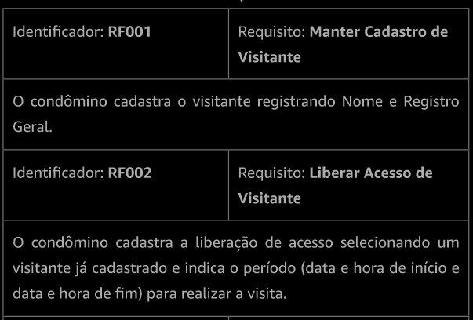
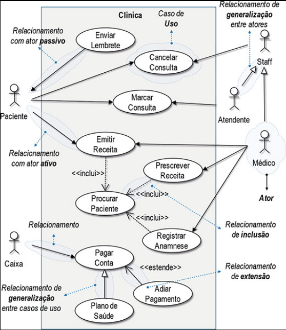

# Engenharia de Requisitos

## Anotações do professor Lucas Bueno

### Última atualização: 21/11/2021

#### Análise e gerência de de requisitos
* O resultado da elicitação de requisitos é o insumo para a análise de requisitos, enquanto o resultado da análise de requisitos é a especificação de requisitos (ou documento de requisitos). No entanto, estas etapas não precisam ocorrer necessariamente de forma sequencial, podendo ocorrer também de forma cíclica;
* Nesta etapa nós queremos "fechar" o produto da engenharia de requisitos (o documento de requisitos), garantindo que o *software* que será gerado atenderá às necessidades do negócio;
* Em geral não é difícil analisar um único requisito, isolado. No entanto, quando vamos analisar de forma conjunta todos os requisitos de um *software* a situação muda de figura;
* É comum que leigos pensem em requisitos de uma maneira mais genérica, como "deve ser possível emitir a Nota Fiscal Eletrônica". É papel do engenheiro de requisitos desmembrar estes requisitos mais genéricos em requisitos mais específicos e que não deixem ambiguidades, como: "O vendedor deve conseguir emitir a Nota Fiscal Eletrônica" e "O cliente deve conseguir emitir a Nota Fiscal Eletrônica";
* Para identificarmos lacunas nos requisitos e para eliminarmos requisitos redundantes e contraditórios é impotante que sigamos estas regras:
    * Expressar apenas um requisito por vez;
    * Expressar os requisitos em uma sentença com verbo em voz ativa e com a identificação clara do que ou de quem será o ator responsável pela ação;
    * Se estamos falando de um CRUD (Create, Read, Update, Delete), utilizar o verbo "manter". Por exemplo: "O vendedor deve conseguir manter o cadastro do cliente".
* Em geral, no documento final de requisitos, temos os requisitos expressos assim:
  
* Após elaborado o documento de requisitos precisamos realizar a **validação dos requisitos**, atividade que busca garantir que o *software* satisfaz o cliente;
* Para validarmos os requisitos e seguirmos na análise dos mesmos existem algumas técnias, entre elas:
    * Histórias do usuário;
    * Modelagem de processos;
    * Decomposição funcional;
    * Modelagem de domínio;
    * **Prototipação**;
    * **Modelagem de casos de uso**: todo *software* deve ter um comportamento em resposta a eventos promovidos por atores - daí o *core* dos casos de uso. Um caso de uso descreve um cenário principal e possíveis cenários alternativos para um ator alcançar um objetivo no sistema. Um caso de uso é composto do diagrama, da descrição dos atores e da especificação do caso de uso:
      
* Já para mantermos (gerenciarmos) os requisitos é ideal que tenhamos um plano, um sistema, para gerenciar mudanças, pois é natural que os requisitos mudem e, então, precisamos mantê-los atualizados;
* Quando falamos em gerência de requisitos também precisamos pensar em priorização de requisitos, que visa definir em que ordem os requisitos serão implementados;
    * E se lembrem: se tudo é prioritário, nada é prioritário!

* Para gerenciarmos os requisitos de um projeto devemos ter um **plano de gerenciamento de requisitos**, que deve conter:
    * como se dá o controle da mudança dos requisitos (quem modifica, aonde modifica, quem aprova);
    * como os requisitos serão priorizados;
    * as ferramentas e repositórios que serão utilizados para gerenciar os requisitos.

* Existem diversos sistemas para gerenciar requisitos e, na maioria deles, ao cadastrar um requisito devemos informar:
    * Uma descrição do requisito;
    * Quem identificou o requisito;
    * Quando o requisito foi identificado;
    * Como o requisito foi indentificado;
    * Qual o impacto do requisito no projeto;
    * Qual a prioridade do requisito;
    * Qual a data limite para implementação/resolução do requisito;
    * Quem irá ou está trabalhando no requisito;
    * A situação atual do requisito (em espera, em desenvolvimento, concluído, etc.).

#### Referências **bibliográficas**
