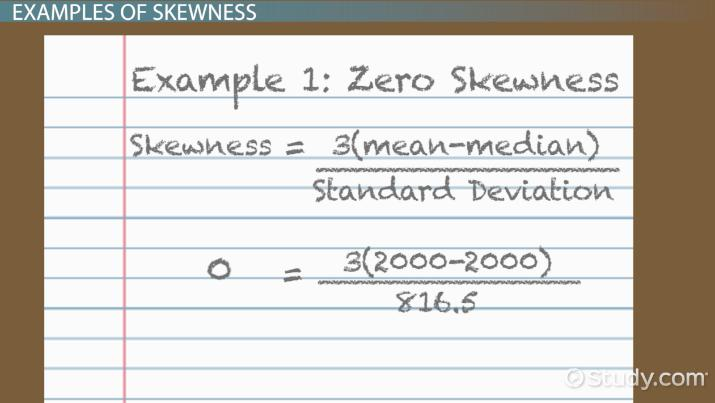
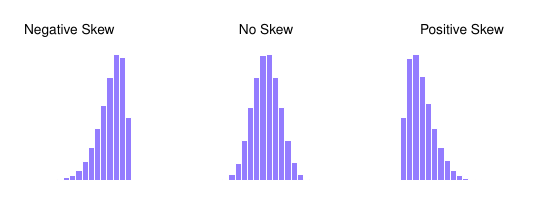
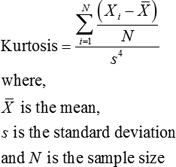
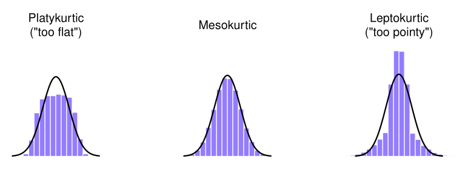
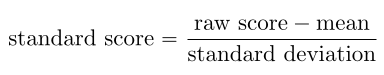
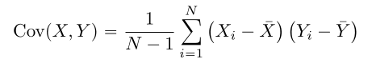

# Matemática aplicada 2

## Anotações do professor Lucas Bueno

### Última atualização: 03/10/2019

#### Datasets:

- Trabalharemos com conjuntos de dados em CSV (Comma-Separated Values)

- Na primeira linha teremos os cabeçalhos

- Cada linha seguinte será uma instância

- Cada valor, ou “coluna”, será separado por um ponto e vírgula

- Exemplo:

     .assets/1570059148808.png)

- Mais em: https://rockcontent.com/blog/csv/

- Para importar um *dataset* no RStudio, na aba *Environment* clicamos em *Import Dataset*: .assets/1570058889236.png)

    - E em seguida *From text (readr)*
    - *Na primeira vez que você for utilizar esta função o RStudio irá instalar os pacotes necessários, pode demorar
    
- *Dataset* das minhas notas em: https://drive.google.com/file/d/1AHWuPSVFC7qJA58cwqZB700xwPpKE53L/view?usp=sharing

#### Estatística descritiva:

O ramo da estatística que visa descrever um conjunto de dados, resumindo-os em um pequeno número de indicadores facilmente entendíveis. Alguns desses indicadores são classificados como de **medidas de tendência central**:

- Média:  (X1+X2+…+Xn)/n, ou: .assets/1570124313406.png)
- Mediana: o valor central
- Moda: o valor que ocorre com mais frequência

- Média truncada: 
- E com os valores nominais?

Algumas funções úteis do R para cálculo de medidas de tendência central:

- sum(dataset$nomeColuna) # soma de todos os valores da coluna
- mean(dataset$nomeColuna) # média de todos os valores da coluna
- mean(dataset$nomeColuna, trim=.1) #média truncada removendo 10% em ambos os lados
- sort(dataset$nomeColuna) # ordena todos os valores da coluna
- median(dataset$nomeColuna) # mediana de todos os valores da coluna
- Os seguintes é necessário instalar o pacote lsr:
    - modeOf(dataset$nomeColuna) # moda de todos os valores da coluna
    - maxFreq(dataset$nomeColuna) # frequência da moda de todos os valores da coluna

------

Outros indicadores são classificados como de **medidas variação**. Os usamos como indicativo do quão “espalhados” estão os dados ou do quão “longe” eles estão da média, por exemplo:

- Mínimo: o menor valor
- Máximo: o maior valor
- Amplitude: o maior valor subtraído do menor valor
- Amplitude interquartil: o maior valor subtraído do menor valor considerando apenas o intervalo entre o 1º e o 3º quartis
- **Desvio absoluto da média**: a média das variações das instâncias em relação a média das instâncias
- O quadrado do desvio absoluto da média, ou a variância: a média dos quadrados das variações das instâncias me relação a média das instâncias
- Desvio padrão: a raíz da variância
    - Quase sempre 68% dos dados estão entre 1 desvio padrão da média, 95% entre 2 desvios padrões, e 99.7% entre 3 desvios padrões.

Algumas funções úteis do R para cálculo de medidas de variação:

- min(dataset$Coluna)
- max(dataset$Coluna)
- range(dataset$Coluna) # amplitude
- IQR(dataset$Coluna) # amplitude interquartil
- sqrt(valores) # raíz quadrada

Um script para calcular o desvio absoluto da média:
```R
media = mean(notas$Nota)
desvioAbsolutoMedia = abs(notas$Nota - media)
desvioPadraoMedia = mean(desvioAbsolutoMedia)
print(desvioPadraoMedia)
```

Um script para calcular a variância:
```R
media = mean(notas$Nota)
desvioQuadradoMedia = abs(notas$Nota - media)*abs(notas$Nota - media)
variancia = mean(desvioQuadradoMedia)
print(desvioPadraoMedia)
```

#### Assimetria (ou skewness):
 - Uma assimetria negativa indica que a média é menor que a mediana, assim com que a distribuição tem uma cauda mais a esquerda

 - Uma assimetria positiva indica que a média é maior que a mediana, assim com que a distribuição tem uma cauda mais a direita

 - Existem várias maneiras de calcular a assimetria, uma bem simples é:

    
 - 
 - Um script para calcular um coeficiente de assimetria:
```R
# primeiramente instale o pacote e1071, depois:
library(e1071)
assimetria = skewness(notas$Nota, na.rm = TRUE, type=1)
print(assimetria)
```
#### Curtose:
 - Uma curtose negativa indica uma distribuição mais "achatada"

 - Uma curtose positiva indica uma distribuição menos "achatada"

 - Existem várias maneiras de calcular a curtose, uma bem simples é:
    

  

 - Um script para calcular um coeficiente de curtose:
```R
# primeiramente instale o pacote e1071, depois:
library(e1071)
curtose = kurtosis(notas$Nota, na.rm = TRUE)
print(curtose)
```
#### Escore padronizado ou Escore-z:
 - A quantos desvios padrões da média uma observação está:
    
 - Como estamos calculando um score relativo a média e ao desvio-padrão de toda a população, podemos utilizar scores padronizados para comparar medições de fenômenos diferentes!

#### Coeficiente de correlação:
 - Quanto um aumento em uma variável implicará no aumento da outra variável:



#### Referências bibliográficas:

1. Bruno Fontana da Silva, Jean Diniz e Matias Américo Bortoluzzi. Minicurso de Estatística Básica: Introdução ao Software R. http://www.uft.edu.br/engambiental/prof/catalunha/arquivos/r/r_bruno.pdf
2. Raul Enrique Cuore. As diferenças históricas entre probabilidade e estatística e sua abordagem no ensino superior.
3. Danielle Navarro. Learning statistics with R. http://compcogscisydney.org/learning-statistics-with-r/
