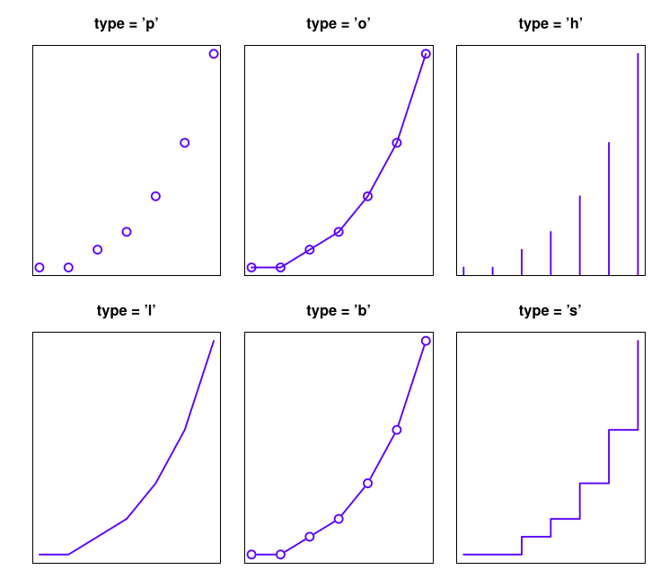

# Matemática aplicada 2

## Anotações do professor Lucas Bueno

### Última atualização: 18/10/2019

#### Gráficos:

- Assim como na estatística descritiva, os gráficos nos permitem, além de gerar boas apresentações, ter também um entendimento maior do que os dados representam

 - Gráfico padrão no R:
```R
plot(notas$Nota)
# a seguir crio 4 variáveis com os argumentos que quero passar para a função plot()
dados = notas$Nota
titulo = "Título do gráfico"
legenda = "Legenda do gráfico"
descX = "Descrição do eixo X"
descY = "Descrição do eixo Y"
plot(x = dados, main = titulo, sub = legenda, xlab = descX, ylab = descY)
```
 - Algumas opções do argumento *type*:
    
 - Histograma:
```R
hist(notas$Nota)
# a seguir crio 4 variáveis com os argumentos que quero passar para a função plot()
dados = notas$Nota
titulo = "Título do gráfico"
legenda = "Legenda do gráfico"
descX = "Descrição do eixo X"
descY = "Descrição do eixo Y"
plot(x = dados, main = titulo, sub = legenda, xlab = descX, ylab = descY)
```

#### Referências bibliográficas:

1. Bruno Fontana da Silva, Jean Diniz e Matias Américo Bortoluzzi. Minicurso de Estatística Básica: Introdução ao Software R. http://www.uft.edu.br/engambiental/prof/catalunha/arquivos/r/r_bruno.pdf
2. Raul Enrique Cuore. As diferenças históricas entre probabilidade e estatística e sua abordagem no ensino superior.
3. Danielle Navarro. Learning statistics with R. http://compcogscisydney.org/learning-statistics-with-r/
