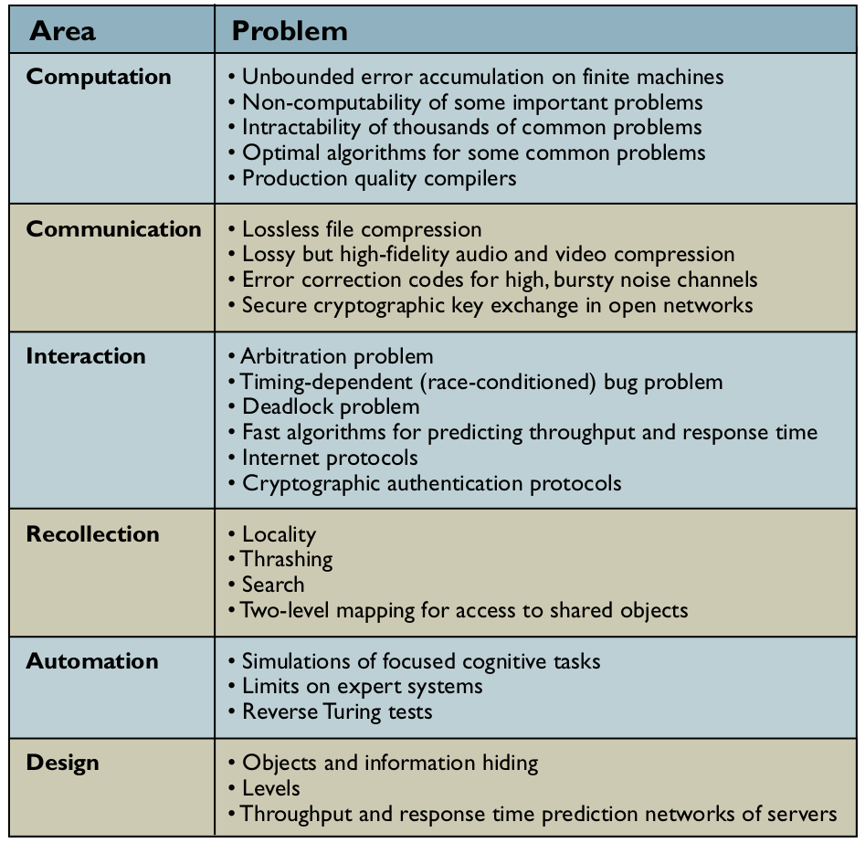

# Metodologia da Pesquisa

## Anotações do professor Lucas Bueno

### Última atualização: 09/11/2020

#### Ciência da computação

- O que é ciência da computação? É realmente uma ciência?
    - "A ciência do processamento da informação e de suas interações com o mundo";
    - "O que pode ser eficientemente automatizado?";
    - O comportamento inteligente é resultado do processamento da informação?;
    - Não estuda computadores, mas sim o processamento (computação) da informação;
    - Iniciou na década de 50;

- Ciência é diferente de desenvolvimento tecnológico
    - Algumas áreas nossas são "apenas" ciência:
        - Complexidade computacional;
        - Matemática computacional;
        - Algoritmos experimentais;
    - Outras são "apenas" engenharia:
        - Engenharia de software;
        - Interação Humano-computador;
    - Mas, a grande maioria, é uma combinação de ciência e engenharia.

- Não é possível atingir a perfeição, mas devemos nos esforçar ao máximo para:

    - Realizar um grande número de observações;
    - Variar amplamente as condições de experimento;
    - Tentar falsear nossa hipótese;
    - Ser neutro;
    - Ser objetivo.

- Algumas classificações das diferentes ciências:

  - Classificação 1:
      - Ciências formais;
      - Ciências empíricas;
          - Naturais;
          - Sociais.
  - Classificação 2:
      - Ciências puras;
      - Ciências aplicadas.
  - Classificação 3:
      - Ciências exatas;
      - Ciências inexatas.
  - Classificação 4:
      - Ciências *soft*;
      - Ciências *hard*.

#### Referências bibliográficas

1. Raul Sidnei Wazlawick. Metodologia da Pesquisa para Ciência da Computação. Publicado pela Elsevier em 2008.
2. Peter J. Denning. Is Computer Science Science? Communications of the ACM. 2005.
