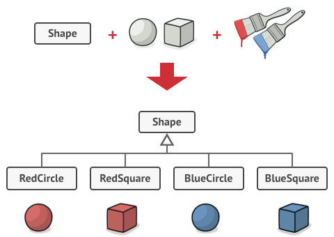
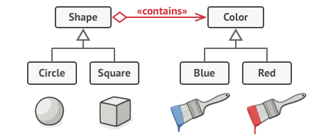

# Padrões de projeto

## Anotações do professor Lucas Bueno

#### Última atualização: 20/02/2020

#### Delegando comportamentos com composição
- "A primeira regra do gerenciamento é a delegação. Não tente fazer tudo sozinho porque você não consegue." – Anthea Turner

#### O padrão Bridge

- É uma alternativa para evitar o crescimento exponencial de subclasses sem utilizar heranças múltiplas

- Problema:


- Solução:



#### Desafio:

```java
public interface Device {
    boolean isEnabled();

    void enable();

    void disable();

    int getVolume();

    void setVolume(int percent);

    int getChannel();

    void setChannel(int channel);

    void printStatus();
}
```

```java
public interface Remote {
    void power();

    void volumeDown();

    void volumeUp();

    void channelDown();

    void channelUp();
}
```

### Referências

- Design Patterns com Java: projeto orientado a objetos guiado por padrões. Eduardo Guerra. Casa do código. 2018.