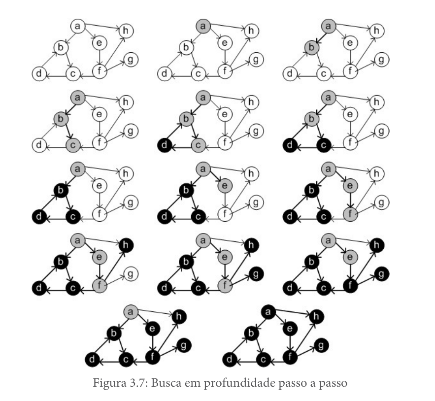
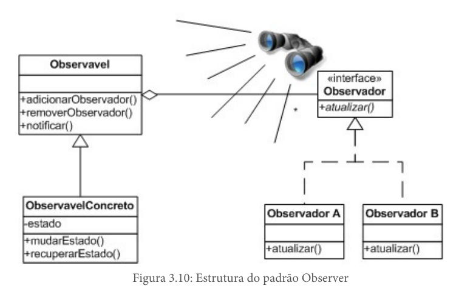

# Padrões de projeto

## Anotações do professor Lucas Bueno

#### Última atualização: 02/03/2020

#### O padrão State
- Utilizado para quando o comportamento de um objeto deve mudar de acordo com o estado que ele assume
- 

#### O padrão Observer

- Utilizado quando a alteração de estado de um objeto precisa ser notificada para outros objetos
- 

### Referências

- Design Patterns com Java: projeto orientado a objetos guiado por padrões. Eduardo Guerra. Casa do código. 2018.