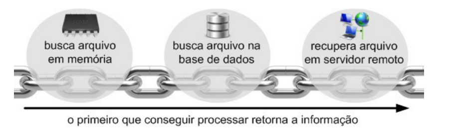

# Padrões de projeto

## Anotações do professor Lucas Bueno

#### Última atualização: 02/03/2020

#### O padrão Chain of Responsibility
- “Nenhuma corrente pode ser mais forte que seu elo mais fraco”
- Chain of Responsibility é um padrão de projeto que cria uma cadeia de execução na qual cada elemento processa as informações e, em seguida, delega a execução ao próximo da sequência.
- 

### Referências

- Design Patterns com Java: projeto orientado a objetos guiado por padrões. Eduardo Guerra. Casa do código. 2018.