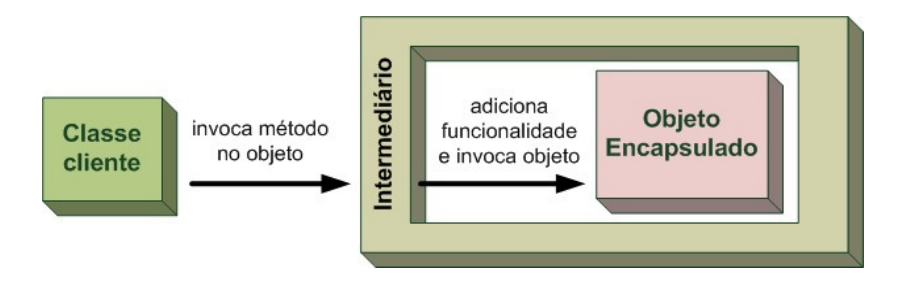

# Padrões de projeto

## Anotações do professor Lucas Bueno

#### Última atualização: 12/04/2020

#### Padrões que envolvem objetos: proxies e decorators
- "O olhar é, antes de mais nada, um intermediário que remete de mim a mim mesmo." – Sartre
- 

### Referências

- Design Patterns com Java: projeto orientado a objetos guiado por padrões. Eduardo Guerra. Casa do código. 2018.