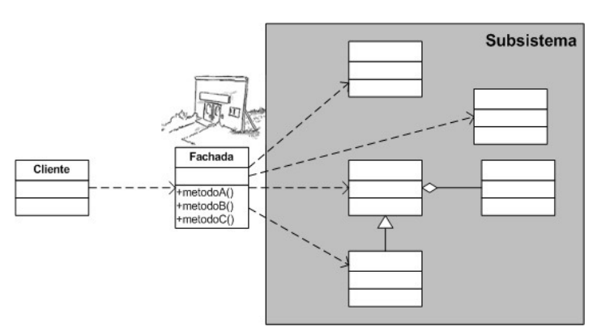

# Padrões de projeto

## Anotações do professor Lucas Bueno

#### Última atualização: 15/05/2020

#### Facade pattern:
- Similar aos padrões proxy e decorator, que nos permitiram “envolver” uma classe
- As diferenças aqui são que:
    - “Envolveremos” mais de uma classe
    - E com o objetivo de simplificar o acesso a uma função que depende de muitas outras classes
- Inclusive, este padrão pode ser utilizado como uma fachada de um sistema legado
- 

#### Flyweight pattern:
- Utilizaremos uma factory para reutilizar instâncias de objetos imutáveis que aparecerão várias vezes durante a execução da aplicação
- Devemos prestar muita atenção para deixar imutáveis os objetos que serão reutilizados!
- 

### Referências

- Design Patterns com Java: projeto orientado a objetos guiado por padrões. Eduardo Guerra. Casa do código. 2018.